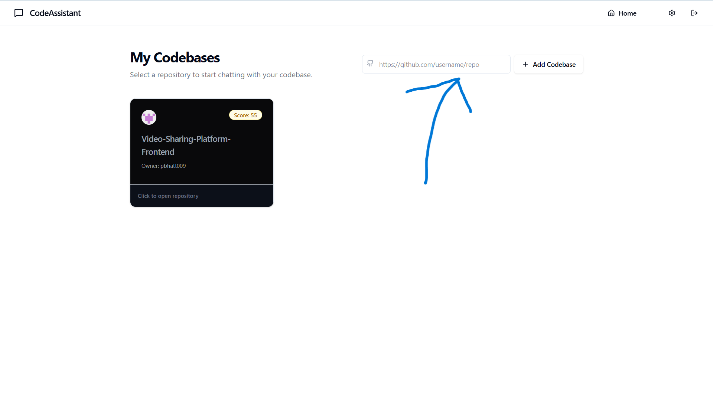
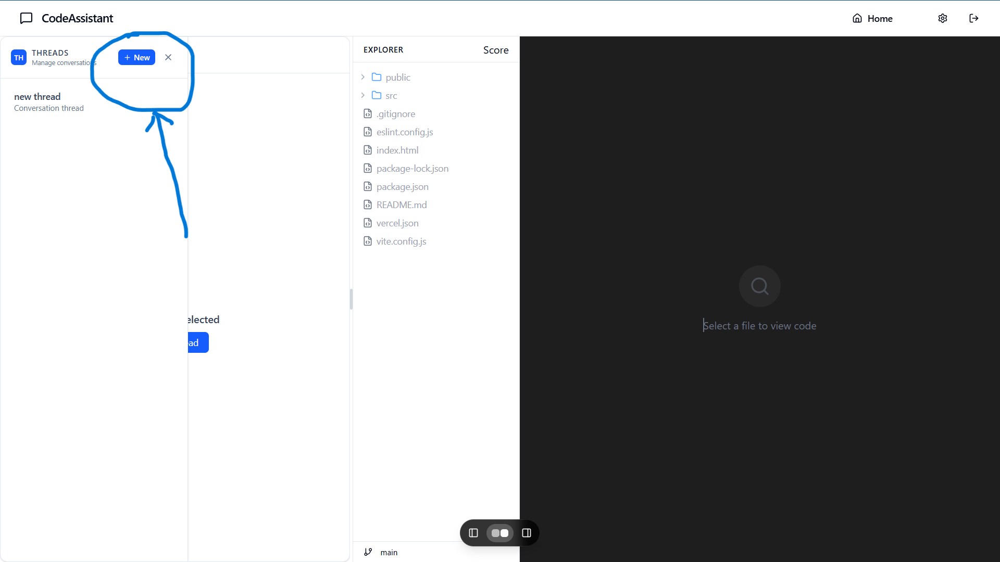
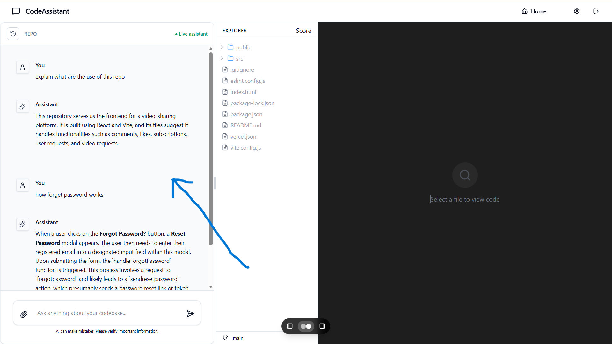
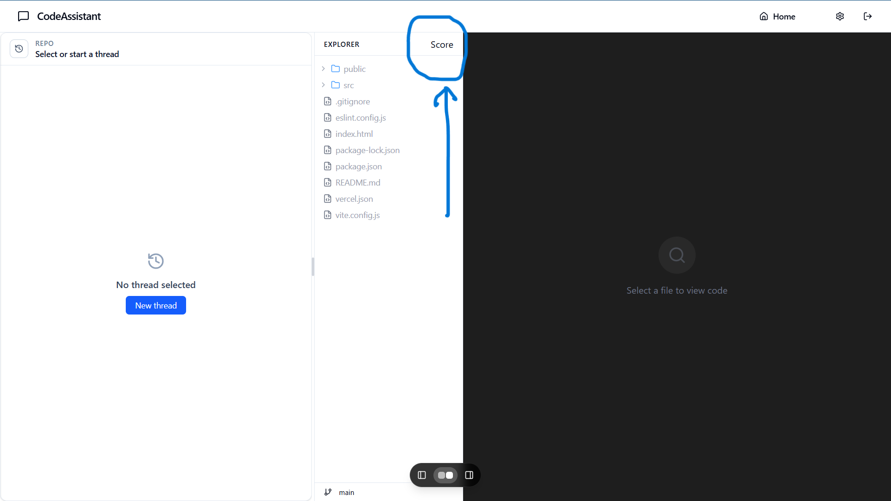

# Codebase Assistant Frontend

A modern React.js frontend for the Codebase Assistant application. This project provides an interactive dashboard for managing repositories, querying codebases, and engaging with content through a chat-like interface. It connects to a backend API for authentication, repository processing, and intelligent codebase queries.


---
# Live: 
https://codebase-assistant-eight.vercel.app

## 🚀 Features

- **User Authentication** (login/signup, anonymous supported)
- **Dashboard UI** for managing repositories
- **Codebase Query Interface** (chat-like assistant)
- **Repository Explorer** (file tree & code viewer)
- **Score Panel** (automated repo analysis)
- **API Integration** (fetch/axios)
- **State Management** (React hooks & Redux)
- **Responsive Design** (Tailwind CSS)
- **Dark/Light Mode** (via Tailwind)
- **Comments, Likes, Subscriptions** _(optional/future)_
- **Video Player / Content Display** _(optional/future)_

---

## 🛠 Tech Stack

- **React.js** (SPA, routing)
- **Tailwind CSS** (utility-first styling)
- **Redux Toolkit** (global state)
- **Axios** (API requests)
- **Supabase** (authentication)
- **Vite** (build tool)
- **Lucide Icons** (UI icons)

---

## 📦 Installation

1. **Clone the repository**
   ```sh
   git clone https://github.com/pbhatt009/codebase-assistant.git
   cd codebase-assistant-frontend
   ```

2. **Install dependencies**
   ```sh
   npm install
   ```

3. **Set up environment variables**

   Create a `.env` file in the root directory:

   ```env
   VITE_API_URL=http://localhost:8000
   VITE_SUPABASE_URL=your_supabase_url
   VITE_SUPABASE_KEY=your_supabase_key
   VITE_GITHUB_TOKEN=your_github_token
   ```

---

## ▶️ Running the App

- **Development**
  ```sh
  npm run dev
  ```

- **Build for Production**
  ```sh
  npm run build
  ```

- **Preview Production Build**
  ```sh
  npm run preview
  ```

---

## 📁 Folder Structure

```
.
├── public/
├── src/
│   ├── assets/
│   ├── components/
│   │   ├── chat/        # Chat UI, threads, message bubbles
│   │   ├── code/        # Code explorer, file tree, code viewer
│   │   ├── layout/      # App shell, split view
│   ├── lib/             # Utility functions (e.g., cn)
│   ├── pages/           # Home, Workspace, Score
│   ├── store/           # Redux slices & store
│   ├── utils/           # API, handlers, supabase
│   ├── App.jsx
│   ├── main.jsx
│   ├── index.css
│   ├── App.css
├── .env
├── package.json
├── tailwind.config.js
├── vite.config.js
└── README.md
```

---

## 🖼 Screenshots

> _Add screenshots for each major feature below._

### 1. Add Repository Link



### 2. Create or Select Thread



### 3. Chat Panel (Codebase Query)



### 4. Score Panel



---


## 🌱 Future Improvements

- Improved codebase analytics
- Real-time collaboration
- More authentication provider
- File based retrieving


